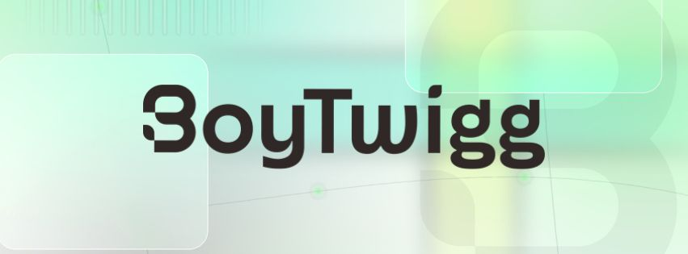

<p align="center">
  
</p>

<h1 align="center">BoyTwigg AI</h1>
<p align="center"><strong>AI systems, agent architecture, and operational automation for teams doing real work.</strong></p>

<p align="center">
  <a href="https://www.boytwigg.ai"></a>
  <a href="mailto:me@boytwigg.ai"></a>
  <a href="https://github.com/boytwigg"></a>
  <a href="https://github.com/boytwigg/vc-agent-architecture"></a>
</p>

---

## What We Do

BoyTwigg AI replaces manual, disconnected processes with systems that hold together: databases that talk to each other, workflows that run without someone chasing them, and AI agents built for one job instead of ten.

<table>
<tr>
<td width="50%" valign="top">
<h3>🧠 AI agents</h3>
<p>Agent teams with clear roles, permissions, handoffs, and human approval points. Built for work such as deal flow, executive communications, and internal operations.</p>
<br>
</td>
<td width="50%" valign="top">
<h3>🗺️ Systems design</h3>
<p>Relational databases, CRM architecture, and connected operating systems. One reliable record of what happened, who owns it, and what comes next.</p>
<br>
</td>
</tr>
<tr>
<td width="50%" valign="top">
<h3>⚡ Automation</h3>
<p>Workflows that connect intake, onboarding, delivery, notifications, and closeout. Less chasing. Fewer dropped handoffs.</p>
<br>
</td>
<td width="50%" valign="top">
<h3>🎓 Workshops</h3>
<p>Practical sessions on AI productivity, entrepreneurship, and mental wellness for organizations, student athletes, and athletic departments.</p>
<br>
</td>
</tr>
</table>

## Who We Help

| | Team | Typical work |
| :---: | --- | --- |
| 💼<br> | **Venture firms**<br> | Deal flow, portfolio, fund operations, and internal agent teams<br> |
| 👤<br> | **Executives**<br> | Operations, communications, client work, and administrative systems<br> |
| 🏢<br> | **Small businesses**<br> | CRM design, workflow automation, data migration, and vendor selection<br> |
| 🏟️<br> | **Athletic departments**<br> | Workshops on entrepreneurship, AI tools, and mental wellness<br> |

## How We Work

```text
DISCOVER  →  DESIGN  →  BUILD  →  TEST  →  HAND OFF
```

| Stage | What Happens |
| --- | --- |
| **Discover**<br> | Map the current workflow, owners, failure points, and constraints.<br> |
| **Design**<br> | Define the system, data model, approvals, and implementation plan.<br> |
| **Build and test**<br> | Ship useful pieces early, validate the data, and test the edge cases.<br> |
| **Hand off**<br> | Deliver documentation and training so the team can run what we built.<br> |

## Selected Work

<table>
<tr>
<td width="50%" valign="top">
<h3>🚀 <a href="https://github.com/boytwigg/vc-agent-architecture">VC Agent Architecture</a></h3>
<p>A public reference build for a 5-agent venture capital team. It covers roles, boundaries, handoffs, privacy considerations, and a phased rollout.</p>
<br>
</td>
<td width="50%" valign="top">
<h3>👋🏾 <a href="https://github.com/boytwigg">Alex Malebranche</a></h3>
<p>Meet the founder and see more work across AI products, operations design, automation, and implementation.</p>
<br>
</td>
</tr>
</table>

<p align="center">
  <a href="https://github.com/boytwigg/vc-agent-architecture"></a>
</p>

## What Clients Receive

| | Deliverable |
| :---: | --- |
| ✅<br> | A system architecture and implementation plan tied to the actual workflow<br> |
| ✅<br> | Working automations with ownership, approvals, and failure handling defined<br> |
| ✅<br> | Database schemas, migration plans, and validation checks where needed<br> |
| ✅<br> | Vendor comparisons grounded in requirements, budget, and tradeoffs<br> |
| ✅<br> | Documentation and training built for the people who will run the system<br> |

## AI Builder Toolbox

Tools we use to move an idea into a working system. The mix changes with the job.

**Build with AI**

<p align="left">
  
  
  
  
  
  
  
  
  
  
  
</p>

**Automate and Operate**

<p align="left">
  
  
  
  
  
  
</p>

**Ship and Integrate**

<p align="left">
  
  
  
  
</p>

## About the founder

[Alex Malebranche](https://boytwigg.com) is a founder, product-minded operator, and U.S. Army Intelligence veteran. His background includes enterprise technology roles at AWS, GitHub, Cloudflare, Plume Design, and Amazon. He now builds AI systems for venture firms, executives, and small teams.

## Start a conversation

Have a process held together by spreadsheets, inboxes, and memory? Bring the messy version. We will start there.

<p align="center">
  <a href="mailto:me@boytwigg.ai"></a>
  <a href="https://www.boytwigg.ai"></a>
</p>

---

<p align="center">© 2026 BoyTwigg AI LLC</p>
